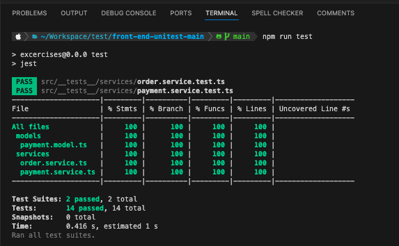

## Test Cases Checklist

### **OrderService**
#### **process(order: Partial<Order>)**
- [x] Should throw an error if `order.items` is missing.
- [x] Should throw an error if any item has `price <= 0`.
- [x] Should throw an error if any item has `quantity <= 0`.
- [x] Should throw an error if any item has both `price <= 0` and `quantity <= 0`.
- [x] Should apply a valid coupon and reduce the total price.
- [x] Should throw an error if the coupon is invalid.
- [x] Should set `totalPrice = 0` when the discount is greater than the total price.
- [x] Should call `paymentService.payViaLink` with the created order.

---

### **PaymentService**
#### **buildPaymentMethod(totalPrice: number)**
- [x] Should always include `CREDIT` as a payment method.
- [x] Should include all payment methods if `totalPrice` is below all thresholds.
- [x] Should exclude `PAYPAY` if `totalPrice > 500,000`.
- [x] Should exclude `AUPAY` if `totalPrice > 300,000`.
- [x] Should exclude both `PAYPAY` and `AUPAY` if `totalPrice > 500,000`.

#### **payViaLink(order: Order)**
- [x] Should open a new window with the correct payment URL.

---

### Test Results
